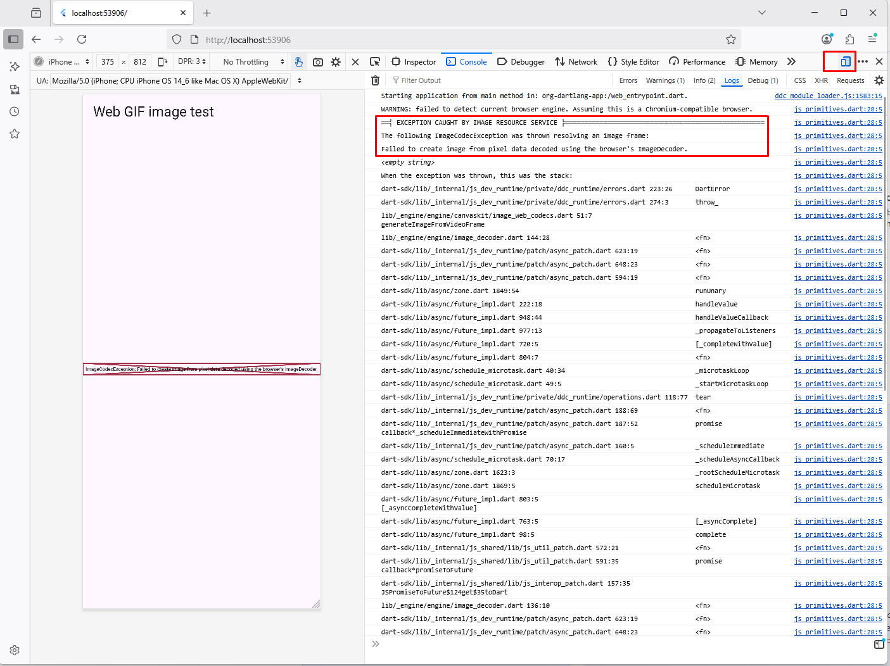
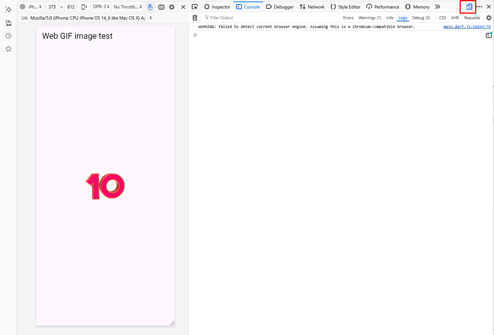

# Testing Flutter web animated GIF bug in Firefox  

In Firefox, when emulating mobile device, animated gif throws an error after a 1st loop:

Check the screen cast video:
[web_gif_Firefox 2025-08-25.mp4](web_gif_Firefox%202025-08-25.mp4)

In release mode, no error, but animation stops on the last frame:
